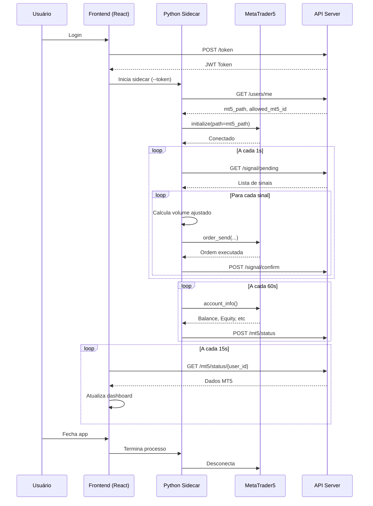

# Client Copier - Documentação Completa

## 📋 Visão Geral

O **Client Copier** é um aplicativo desktop Tauri que recebe sinais de trading de uma conta "master" e replica automaticamente as operações em uma conta MT5 "follower" (cliente).

**Tecnologias:**
- **Frontend:** React + TypeScript + Vite
- **Backend Desktop:** Tauri (Rust)
- **Python Sidecar:** Script Python que conecta ao MT5 e executa ordens
- **API:** Comunicação com servidor Rust central

---

## 🏗️ Arquitetura

```
┌─────────────────────────────────────────┐
│        Client Copier (Tauri App)        │
├─────────────────────────────────────────┤
│  Frontend (React)                       │
│  - Login/Auth                           │
│  - Dashboard com status MT5             │
│  - Performance financeira               │
│  - Sinais recebidos                     │
├─────────────────────────────────────────┤
│  Python Sidecar (client-service.exe)    │
│  - Conecta ao MT5 via mt5_path          │
│  - Busca sinais pendentes (1s)          │
│  - Calcula volume ajustado              │
│  - Executa ordens no MT5                │
│  - Confirma execução via API            │
│  - Atualiza status MT5 (60s)            │
└─────────────────────────────────────────┘
         ↓ HTTP/REST
┌─────────────────────────────────────────┐
│      API Server (Rust - Axum)           │
│  - Autentica usuário                    │
│  - Fornece sinais pendentes             │
│  - Recebe confirmações de execução      │
│  - Fornece mt5_path e allowed_mt5_id    │
│  - Cache de status MT5                  │
└─────────────────────────────────────────┘
```

---

## 🚀 Funcionalidades

### 1. Autenticação
- Login com username/password
- Token JWT armazenado em `sessionStorage`
- Auto-logout em caso de token expirado

### 2. Dashboard
- **Status MT5 em Tempo Real:**
  - 🟢 Conectado: Mostra Server, Account ID, Balance, Equity
  - 🔴 Desconectado: Mostra mensagem de aguardando conexão + Allowed MT5 ID
- **Métricas de Sinais:**
  - Total Received (sinais recebidos nos últimos 7 dias)
  - Executed (sinais copiados com sucesso)
  - Rejected (sinais que falharam)
- **Performance Financeira:**
  - PnL Today/Week/Month
  - Placeholder para gráfico de histórico
- **Sinais Recentes:**
  - Lista dos últimos 5 sinais ativos
  - Detalhes: Symbol, Type, Volume, Price

### 3. Recepção de Sinais
O Python sidecar busca sinais pendentes a cada **1 segundo** via GET `/signal/pending`

### 4. Execução de Ordens
Quando um sinal é recebido:
1. **Calcula volume ajustado** proporcionalmente ao saldo
2. **Prepara request MT5** com SL/TP
3. **Executa ordem** via `mt5.order_send()`
4. **Confirma execução** via POST `/signal/confirm`

#### Cálculo de Volume
```python
def _calculate_volume(self, master_volume, master_balance, client_balance):
    ratio = client_balance / master_balance
    adjusted_volume = master_volume * ratio
    adjusted_volume = round(adjusted_volume, 2)
    if adjusted_volume < 0.01:
        adjusted_volume = 0.01
    return adjusted_volume
```

**Exemplo:**
- Master: 1.0 lote, saldo $10,000
- Client: saldo $5,000
- Volume ajustado: 0.5 lote

---

## 🔧 Configuração

### Arquivo: `config_client.json`
```json
{
  "api": {
    "url": "http://127.0.0.1:8000"
  },
  "mt5": {
    "login": 0,
    "path": ""
  },
  "service": {
    "loop_interval": 1
  }
}
```

**Nota:** `mt5_path` e `allowed_mt5_id` são **sempre** buscados do banco de dados via API.

---

## 📁 Estrutura de Arquivos

```
client_copier/
├── gui/                          # Frontend Tauri
│   ├── src/
│   │   ├── pages/
│   │   │   └── dashboards/
│   │   │       ├── DashboardClient.tsx   # Dashboard principal
│   │   │       └── DashboardMaster.tsx   # (não usado)
│   │   ├── services/
│   │   │   ├── api.ts            # Cliente API
│   │   │   └── pythonSidecar.ts  # Gerencia Python sidecar
│   │   ├── components/
│   │   │   ├── ui/card.tsx       # Componente Card
│   │   │   └── DashboardLayout.tsx
│   │   ├── contexts/
│   │   │   └── AuthContext.tsx   # Contexto de autenticação
│   │   └── App.tsx               # App principal
│   ├── src-tauri/
│   │   ├── src/main.rs           # Backend Tauri (Rust)
│   │   ├── client-service.exe    # Python sidecar compilado
│   │   └── tauri.conf.json       # Configuração Tauri
│   └── package.json
├── main_client.py                # Entry point Python
├── client_service.py             # Lógica principal de cópia
├── mt5_connector.py              # Conexão com MT5
├── config_client.json            # Configuração
├── client-service.spec           # PyInstaller spec
└── rebuild_client_clean.ps1      # Script de build
```

---

## 🐛 Erros Resolvidos

### 1. Race Condition - Conexão MT5 Errada
**Problema:** Client conectava na conta master quando ambos estavam abertos.

**Solução:** Mesma do Master Sender - usar `mt5_path` específico e pular Observer Mode.

### 2. Volume Mínimo MT5
**Problema:** Ordens falhavam com volume muito pequeno.

**Solução:**
```python
if adjusted_volume < 0.01:
    adjusted_volume = 0.01  # Mínimo do MT5
```

### 3. Ordem Duplicada
**Problema:** Mesmo sinal executado múltiplas vezes.

**Solução:** Verificar `processed=1` no banco antes de executar.

---

## 🔌 Integrações

### 1. API Server (Rust)
**Endpoints Utilizados:**
- `POST /token` - Login
- `GET /users/me` - Busca `mt5_path` e `allowed_mt5_id`
- `GET /signal/pending` - Busca sinais pendentes
- `POST /signal/confirm` - Confirma execução
- `POST /mt5/status` - Atualiza status MT5
- `GET /mt5/status/{user_id}` - Dashboard busca status
- `GET /signals` - Lista sinais recentes

### 2. MetaTrader5 Python API
**Métodos Principais:**
- `mt5.initialize(path=mt5_path)` - Conecta ao terminal
- `mt5.account_info()` - Busca dados da conta
- `mt5.symbol_info_tick(symbol)` - Busca preço atual
- `mt5.order_send(request)` - Executa ordem

#### Exemplo de Request
```python
request = {
    "action": mt5.TRADE_ACTION_DEAL,
    "symbol": "EURUSD",
    "volume": 0.05,
    "type": mt5.ORDER_TYPE_BUY,
    "price": mt5.symbol_info_tick("EURUSD").ask,
    "sl": 1.0800,
    "tp": 1.0900,
    "deviation": 20,
    "magic": 234000,
    "comment": "Copy from Master #123456",
    "type_time": mt5.ORDER_TIME_GTC,
    "type_filling": mt5.ORDER_FILLING_IOC,
}
```

### 3. Tauri Sidecar
**Comunicação:**
- Frontend inicia sidecar via `Command::new_sidecar("client-service")`
- Passa `--token` como argumento
- Monitora processo via PID

---

## 🔒 Segurança

### Validação de Conta
Antes de executar qualquer ordem:
```python
info = mt5.account_info()
if info.login != target_login:
    logger.critical(f"Wrong Account! Expected {target_login}, got {info.login}")
    return False
```

### Single Instance Lock
```python
LOCK_FILE = os.path.join(os.environ.get('TEMP', ''), 'aibot_client.lock')
```

---

## 📦 Build e Deploy

### Build Manual
```powershell
powershell -ExecutionPolicy Bypass -File rebuild_client_clean.ps1
```

**Artefatos gerados:**
- `gui/src-tauri/target/release/client-copier.exe`
- `gui/src-tauri/target/release/bundle/nsis/*.exe` (instalador)

---

## 🧪 Testes

### Teste de Conexão MT5
1. Abrir MT5 com conta client
2. Fazer login no Client Copier
3. ✅ Verificar card verde com dados do MT5

### Teste de Cópia de Sinal
1. Master abre posição EURUSD BUY 0.10
2. ✅ Client recebe sinal
3. ✅ Client calcula volume ajustado
4. ✅ Client executa ordem
5. ✅ Verificar log: "✅ Ordem executada: #..."

### Teste de Proporção de Volume
**Cenário:**
- Master: Balance $10,000, Volume 1.0
- Client: Balance $5,000

**Esperado:**
- Client executa com volume 0.5

---

## 🔄 Ciclo de Vida



---

## 📚 Documentação Relacionada

- [Guia de Desenvolvimento Python](file:///c:/Users/josemejia/dev/python/aibot/backend/copy/docs/development/PYTHON_DEV_GUIDE.md)
- [Erros Críticos](file:///c:/Users/josemejia/dev/python/aibot/backend/copy/docs/troubleshooting/CRITICAL_ERRORS.md)
- [Guia de Build](file:///c:/Users/josemejia/dev/python/aibot/backend/copy/docs/development/BUILD_GUIDE.md)
- [Arquitetura MT5](file:///c:/Users/josemejia/dev/python/aibot/backend/copy/docs/architecture/MT5_ARCHITECTURE.md)
- [Conexão MT5 nos Dashboards](file:///C:/Users/josemejia/.gemini/antigravity/brain/d98a47ee-ba80-4b99-ab97-3cc71734a454/MT5_CONNECTION.md)

---

## 💡 Dicas para Desenvolvedores

### Debug do Python Sidecar
```bash
cd client_copier
python main_client.py --token=SEU_TOKEN_AQUI
```

### Ver Logs em Tempo Real
```bash
tail -f client.log
```

### Simular Sinal Manualmente
```python
# No Python REPL
import requests
requests.post("http://localhost:8000/signal/broadcast", json={
    "master_ticket": 999999,
    "symbol": "EURUSD",
    "type": "BUY",
    "volume": 0.10,
    "price": 1.0850,
    "sl": 1.0800,
    "tp": 1.0900
}, headers={"Authorization": "Bearer TOKEN"})
```

### Forçar Fechamento de Todas as Posições
```bash
cd client_copier
python force_close_all.py
```

---

## ⚠️ Avisos Importantes

### Gerenciamento de Risco
- **Sempre** configure SL/TP adequados
- **Monitore** o saldo antes de copiar sinais
- **Teste** em conta demo primeiro

### Latência
- Sinais são copiados com delay de até 1 segundo
- Slippage pode ocorrer em mercados voláteis

### Dependências de Conta
- Client **DEVE** ter os mesmos símbolos disponíveis que o Master
- Leverage pode diferir (volume é ajustado pelo saldo, não leverage)
