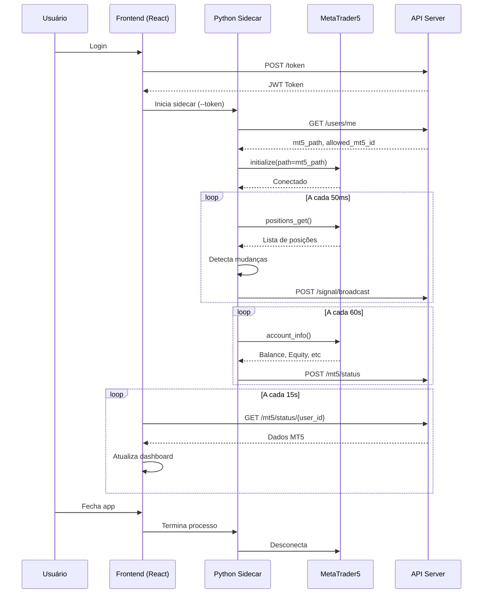

# Master Sender - Documentação Completa

## 📋 Visão Geral

O **Master Sender** é um aplicativo desktop Tauri que monitora uma conta MT5 "master" e transmite sinais de trading para contas "follower" (clientes) em tempo real.

**Tecnologias:**
- **Frontend:** React + TypeScript + Vite
- **Backend Desktop:** Tauri (Rust)
- **Python Sidecar:** Script Python que conecta ao MT5 e envia sinais
- **API:** Comunicação com servidor Rust central

---

## 🏗️ Arquitetura

```
┌─────────────────────────────────────────┐
│         Master Sender (Tauri App)       │
├─────────────────────────────────────────┤
│  Frontend (React)                       │
│  - Login/Auth                           │
│  - Dashboard com status MT5             │
│  - Configurações                        │
│  - Monitor de sinais                    │
├─────────────────────────────────────────┤
│  Python Sidecar (sender-service.exe)    │
│  - Conecta ao MT5 via mt5_path          │
│  - Monitora posições abertas            │
│  - Detecta novos trades                 │
│  - Envia sinais via API (HMAC)          │
│  - Atualiza status MT5 (60s)            │
└─────────────────────────────────────────┘
         ↓ HTTP/REST
┌─────────────────────────────────────────┐
│      API Server (Rust - Axum)           │
│  - Autentica usuário                    │
│  - Armazena sinais no banco             │
│  - Fornece mt5_path e allowed_mt5_id    │
│  - Cache de status MT5                  │
└─────────────────────────────────────────┘
```

---

## 🚀 Funcionalidades

### 1. Autenticação
- Login com username/password
- Token JWT armazenado em `sessionStorage`
- Auto-logout em caso de token expirado

### 2. Dashboard
- **Status MT5 em Tempo Real:**
  - 🟢 Conectado: Mostra Server, Balance, Equity, Leverage, Margin Level, Open Positions
  - 🔴 Desconectado: Mostra mensagem de aguardando conexão
- **Métricas:**
  - Signals Sent (total de sinais enviados)
  - Active Clients (clientes conectados)
  - Subscription (tipo de assinatura)
- **Sinais Ativos:**
  - Lista de posições abertas no MT5
  - Detalhes: Symbol, Type (BUY/SELL), Volume, Entry, SL, TP
  - Timestamp e Ticket number

### 3. Detecção de Sinais
O Python sidecar monitora o MT5 a cada **50ms** e detecta:
- **Novas Posições:** Quando um trade é aberto
- **Modificações:** Quando SL/TP são alterados
- **Fechamentos:** Quando um trade é fechado

### 4. Transmissão de Sinais
Sinais são enviados via POST `/signal/broadcast` com:
- **Autenticação HMAC:** Assinatura SHA256 do payload
- **Payload:**
  ```json
  {
    "master_ticket": 123456,
    "symbol": "EURUSD",
    "type": "BUY",
    "volume": 0.10,
    "price": 1.0850,
    "sl": 1.0800,
    "tp": 1.0900
  }
  ```

---

## 🔧 Configuração

### Arquivo: `config_sender.json`
```json
{
  "api": {
    "url": "http://127.0.0.1:8000"
  },
  "mt5": {
    "login": 0,
    "path": ""
  },
  "service": {
    "loop_interval": 0.05
  }
}
```

**Nota:** `mt5_path` e `allowed_mt5_id` são **sempre** buscados do banco de dados via API, nunca do arquivo local.

---

## 📁 Estrutura de Arquivos

```
master_sender/
├── gui/                          # Frontend Tauri
│   ├── src/
│   │   ├── pages/
│   │   │   └── dashboards/
│   │   │       └── DashboardMaster.tsx  # Dashboard principal
│   │   ├── services/
│   │   │   ├── api.ts            # Cliente API
│   │   │   └── pythonSidecar.ts  # Gerencia Python sidecar
│   │   ├── components/
│   │   │   ├── ui/card.tsx       # Componente Card
│   │   │   └── DashboardLayout.tsx
│   │   ├── contexts/
│   │   │   └── AuthContext.tsx   # Contexto de autenticação
│   │   └── App.tsx               # App principal
│   ├── src-tauri/
│   │   ├── src/main.rs           # Backend Tauri (Rust)
│   │   ├── sender-service.exe    # Python sidecar compilado
│   │   └── tauri.conf.json       # Configuração Tauri
│   └── package.json
├── main_sender.py                # Entry point Python
├── sender_service.py             # Lógica principal de monitoramento
├── mt5_connector.py              # Conexão com MT5
├── config_sender.json            # Configuração
├── sender-service.spec           # PyInstaller spec
└── rebuild_master_clean.ps1      # Script de build
```

---

## 🐛 Erros Resolvidos

### 1. Race Condition - Conexão MT5 Errada
**Problema:** Master conectava na conta errada quando múltiplos MT5 estavam abertos.

**Causa:** Observer Mode esperava qualquer `terminal64.exe` em vez de usar o `mt5_path` específico.

**Solução:** [mt5_connector.py](file:///c:/Users/josemejia/dev/python/aibot/backend/copy/master_sender/mt5_connector.py#L24-L47)
```python
if not path:
    # Só usa Observer Mode se NÃO tiver path específico
    while "terminal64.exe" in tasklist:
        break
else:
    logger.info(f"Skipping Observer Mode. Using path: {path}")
    # Vai direto para mt5.initialize(path=path)
```

### 2. Numpy 2.x Incompatibilidade
**Problema:** `ModuleNotFoundError: No module named 'numpy'` ao executar `.exe`

**Causa:** Numpy 2.0+ incompatível com MetaTrader5 e PyInstaller.

**Solução:**
```bash
pip install "numpy<2"
```

Versão testada: `numpy==1.26.4`

### 3. PyInstaller Hidden Imports
**Problema:** `ImportError: No module named 'MetaTrader5'`

**Solução:** [sender-service.spec](file:///c:/Users/josemejia/dev/python/aibot/backend/copy/master_sender/sender-service.spec#L11)
```python
hiddenimports=['MetaTrader5', 'requests', 'sender_service', 'numpy']
```

---

## 🔌 Integrações

### 1. API Server (Rust)
**Endpoints Utilizados:**
- `POST /token` - Login
- `GET /users/me` - Busca `mt5_path` e `allowed_mt5_id`
- `POST /signal/broadcast` - Envia sinais (com HMAC)
- `POST /mt5/status` - Atualiza status MT5
- `GET /mt5/status/{user_id}` - Dashboard busca status

### 2. MetaTrader5 Python API
**Métodos Principais:**
- `mt5.initialize(path=mt5_path)` - Conecta ao terminal
- `mt5.account_info()` - Busca dados da conta
- `mt5.positions_get()` - Lista posições abertas
- `mt5.orders_get()` - Lista ordens pendentes

### 3. Tauri Sidecar
**Comunicação:**
- Frontend inicia sidecar via `Command::new_sidecar("sender-service")`
- Passa `--token` como argumento
- Monitora processo via PID

---

## 🔒 Segurança

### HMAC Signature
Todos os sinais são assinados com HMAC-SHA256:

```python
timestamp = str(int(time.time() * 1000))
payload_str = json.dumps(payload, sort_keys=True, separators=(',', ':'))
canonical = f"{timestamp}.{payload_str}"
signature = hmac.new(token.encode(), canonical.encode(), hashlib.sha256).hexdigest()

headers = {
    "X-Timestamp": timestamp,
    "X-Signature": signature
}
```

### Single Instance Lock
Previne múltiplas instâncias:
```python
LOCK_FILE = os.path.join(os.environ.get('TEMP', ''), 'aibot_master.lock')
```

---

## 📦 Build e Deploy

### Build Manual
```powershell
# Executar da raiz do projeto
powershell -ExecutionPolicy Bypass -File rebuild_master_clean.ps1
```

**O que o script faz:**
1. Mata processos antigos
2. Limpa cache (build/, dist/, target/)
3. Recompila Python com PyInstaller
4. Copia `sender-service.exe` para `gui/src-tauri/`
5. Executa `npm run tauri build`

**Artefatos gerados:**
- `gui/src-tauri/target/release/master-sender.exe` (executável)
- `gui/src-tauri/target/release/bundle/nsis/*.exe` (instalador)

### Pré-requisitos
- Python 3.12.x
- Numpy `<2.0`
- Node.js 18+
- Rust 1.70+

---

## 🧪 Testes

### Teste de Conexão MT5
1. Abrir MT5 com conta master
2. Fazer login no Master Sender
3. ✅ Verificar card verde com dados do MT5
4. ✅ Logs devem mostrar: "Skipping Observer Mode"

### Teste de Detecção de Sinais
1. Abrir posição no MT5
2. ✅ Verificar log: "🆕 Nova posição detectada"
3. ✅ Verificar API recebeu POST `/signal/broadcast`

### Teste de Desconexão
1. Fechar MT5
2. ✅ Após ~60s, dashboard mostra card vermelho

---

## 📚 Documentação Relacionada

- [Guia de Desenvolvimento Python](file:///c:/Users/josemejia/dev/python/aibot/backend/copy/docs/development/PYTHON_DEV_GUIDE.md)
- [Erros Críticos](file:///c:/Users/josemejia/dev/python/aibot/backend/copy/docs/troubleshooting/CRITICAL_ERRORS.md)
- [Guia de Build](file:///c:/Users/josemejia/dev/python/aibot/backend/copy/docs/development/BUILD_GUIDE.md)
- [Arquitetura MT5](file:///c:/Users/josemejia/dev/python/aibot/backend/copy/docs/architecture/MT5_ARCHITECTURE.md)
- [Conexão MT5 nos Dashboards](file:///C:/Users/josemejia/.gemini/antigravity/brain/d98a47ee-ba80-4b99-ab97-3cc71734a454/MT5_CONNECTION.md)

---

## 🔄 Ciclo de Vida



---

## 💡 Dicas para Desenvolvedores

### Debug do Python Sidecar
```bash
# Executar manualmente para ver logs
cd master_sender
python main_sender.py --token=SEU_TOKEN_AQUI
```

### Ver Logs em Tempo Real
```bash
tail -f sender.log
```

### Limpar Lock Files
```bash
del %TEMP%\aibot_master.lock
```

### Rebuild Rápido (só Python)
```bash
cd master_sender
pyinstaller sender-service.spec --clean --noconfirm
cp dist/sender-service.exe gui/src-tauri/sender-service.exe
```
