# Arquitetura MT5 - Conexão e Comunicação

## 🏗️ Visão Geral

Este documento detalha como o sistema se conecta ao MetaTrader5 e processa sinais de trading.

---

## Arquitetura de Conexão

### Modos de Operação

O MetaTrader5 Python API suporta dois modos:

#### 1. Observer Mode (Modo Observador)
```python
mt5.initialize()  # Sem argumentos
```
- Conecta ao **primeiro terminal ativo** encontrado
- Não inicia novo processo
- **Problema:** Em ambientes com múltiplos terminais, não há controle sobre qual será usado

#### 2. Direct Path Mode (Modo Caminho Direto)
```python
mt5.initialize(path=r"C:\Program Files\MT5\terminal64.exe")
```
- Conecta ao terminal **específico** do caminho
- Pode iniciar novo processo se não estiver rodando
- **Solução adotada** neste projeto

### Implementação no Projeto

```python
# mt5_connector.py
def connect(self, account_config):
    target_login = int(account_config.get('login', 0))
    path = account_config.get('path')
    
    # Decisão: usar Observer ou Direct Path?
    if not path:
        # Fallback: Observer Mode
        logger.info("No path provided. Using Observer Mode...")
        # Espera qualquer terminal64.exe aparecer
        while True:
            if "terminal64.exe" in tasklist:
                break
            time.sleep(2)
    else:
        # Modo recomendado: Direct Path
        logger.info(f"Using Direct Path: {path}")
    
    # Inicialização
    if path:
        success = mt5.initialize(path=path)
    else:
        success = mt5.initialize()
    
    # Validação de conta
    info = mt5.account_info()
    if info.login != target_login:
        logger.critical(f"Wrong Account! Expected {target_login}, got {info.login}")
        return False
    
    return True
```

---

## Fluxo de Dados

### Master Sender


### Client Copier


---

## Detecção de Sinais (Master)

### Algoritmo de Detecção

```python
def _check_and_send(self):
    # 1. Buscar estado atual do MT5
    positions = mt5.positions_get()
    orders = mt5.orders_get()
    
    # 2. Criar mapa do estado atual
    current_map = {}
    for p in positions:
        current_map[p.ticket] = {
            "obj": p,
            "type": "position",
            "sl": p.sl,
            "tp": p.tp,
            "volume": p.volume
        }
    
    # 3. Detectar NOVAS posições
    for ticket, item in current_map.items():
        if ticket not in self.last_state:
            logger.info(f"🆕 Nova posição detectada: {ticket}")
            self._send_signal({
                "master_ticket": ticket,
                "symbol": item["obj"].symbol,
                "type": self._map_order_type(item["obj"].type),
                "volume": item["volume"],
                "price": item["obj"].price_open,
                "sl": item["sl"],
                "tp": item["tp"]
            })
    
    # 4. Detectar MODIFICAÇÕES (SL/TP)
    for ticket, item in current_map.items():
        if ticket in self.last_state:
            last = self.last_state[ticket]
            if abs(item["sl"] - last["sl"]) > 1e-5 or \
               abs(item["tp"] - last["tp"]) > 1e-5:
                logger.info(f"✏️ Modificação detectada: {ticket}")
                self._send_signal({...})  # Mesmo payload
    
    # 5. Detectar FECHAMENTOS
    closed_tickets = [t for t in self.last_state if t not in current_map]
    for ticket in closed_tickets:
        logger.info(f"🔒 Fechamento detectado: {ticket}")
        self._send_close(ticket)
    
    # 6. Atualizar estado
    self.last_state = current_map
```

### Tipos de Ordem

```python
def _map_order_type(self, type_int):
    mapping = {
        0: "BUY",           # Compra a mercado
        1: "SELL",          # Venda a mercado
        2: "BUY_LIMIT",     # Ordem limitada de compra
        3: "SELL_LIMIT",    # Ordem limitada de venda
        4: "BUY_STOP",      # Stop de compra
        5: "SELL_STOP"      # Stop de venda
    }
    return mapping.get(type_int, "UNKNOWN")
```

---

## Execução de Ordens (Client)

### Cálculo de Volume

```python
def _calculate_volume(self, master_volume, master_balance, client_balance):
    """
    Ajusta volume proporcionalmente ao saldo
    
    Exemplo:
    - Master: 1.0 lote, saldo $10,000
    - Client: saldo $5,000
    - Volume ajustado: 0.5 lote
    """
    if master_balance == 0:
        return master_volume  # Fallback
    
    ratio = client_balance / master_balance
    adjusted_volume = master_volume * ratio
    
    # Arredondar para 0.01 (mínimo MT5)
    adjusted_volume = round(adjusted_volume, 2)
    
    # Garantir mínimo de 0.01
    if adjusted_volume < 0.01:
        adjusted_volume = 0.01
    
    return adjusted_volume
```

### Envio de Ordem

```python
def _execute_signal(self, signal):
    symbol = signal["symbol"]
    order_type = signal["type"]
    volume = self._calculate_volume(signal["volume"])
    
    # Preparar request
    request = {
        "action": mt5.TRADE_ACTION_DEAL,
        "symbol": symbol,
        "volume": volume,
        "type": mt5.ORDER_TYPE_BUY if order_type == "BUY" else mt5.ORDER_TYPE_SELL,
        "price": mt5.symbol_info_tick(symbol).ask,
        "sl": signal["sl"],
        "tp": signal["tp"],
        "deviation": 20,
        "magic": 234000,
        "comment": f"Copy from Master #{signal['master_ticket']}",
        "type_time": mt5.ORDER_TIME_GTC,
        "type_filling": mt5.ORDER_FILLING_IOC,
    }
    
    # Enviar ordem
    result = mt5.order_send(request)
    
    if result.retcode != mt5.TRADE_RETCODE_DONE:
        logger.error(f"❌ Ordem falhou: {result.retcode} - {result.comment}")
        return False
    
    logger.info(f"✅ Ordem executada: #{result.order}")
    return True
```

---

## Segurança e Autenticação

### HMAC Signature

Todas as requisições críticas (broadcast de sinais) usam assinatura HMAC:

```python
def _get_headers(self, payload=None):
    headers = {
        "Authorization": f"Bearer {self.token}",
        "Content-Type": "application/json"
    }
    
    if payload:
        # 1. Timestamp atual (milissegundos)
        timestamp = str(int(time.time() * 1000))
        
        # 2. JSON canônico (ordenado, sem espaços)
        payload_str = json.dumps(payload, sort_keys=True, separators=(',', ':'))
        
        # 3. String canônica: timestamp.payload
        canonical = f"{timestamp}.{payload_str}"
        
        # 4. HMAC-SHA256
        signature = hmac.new(
            self.token.encode('utf-8'),
            canonical.encode('utf-8'),
            hashlib.sha256
        ).hexdigest()
        
        # 5. Headers de segurança
        headers["X-Timestamp"] = timestamp
        headers["X-Signature"] = signature
    
    return headers
```

### Validação no Servidor (Rust)

```rust
pub async fn verify_hmac(
    headers: &HeaderMap,
    body: &str,
    token: &str,
) -> Result<(), StatusCode> {
    let timestamp = headers.get("X-Timestamp")
        .ok_or(StatusCode::UNAUTHORIZED)?
        .to_str().unwrap();
    
    let signature = headers.get("X-Signature")
        .ok_or(StatusCode::UNAUTHORIZED)?
        .to_str().unwrap();
    
    // Recriar string canônica
    let canonical = format!("{}.{}", timestamp, body);
    
    // Calcular HMAC esperado
    let mut mac = HmacSha256::new_from_slice(token.as_bytes()).unwrap();
    mac.update(canonical.as_bytes());
    let expected = hex::encode(mac.finalize().into_bytes());
    
    // Comparação constant-time
    if signature != expected {
        return Err(StatusCode::UNAUTHORIZED);
    }
    
    // Validar timestamp (máximo 5 minutos)
    let now = SystemTime::now().duration_since(UNIX_EPOCH).unwrap().as_millis();
    let ts: u128 = timestamp.parse().unwrap();
    if now - ts > 300_000 {  // 5 minutos
        return Err(StatusCode::UNAUTHORIZED);
    }
    
    Ok(())
}
```

---

## Performance e Otimizações

### Loop Interval

```python
# Master: 50ms (20 verificações/segundo)
time.sleep(0.05)

# Client: 1s (1 verificação/segundo)
time.sleep(1)
```

**Rationale:**
- Master precisa detectar trades rapidamente
- Client não precisa polling agressivo (sinais já estão no banco)

### Caching de Estado

```python
# Evita re-processar mesmas posições
self.last_state = {
    ticket: {"sl": ..., "tp": ..., "volume": ...}
}

# Só envia sinal se houver mudança
if ticket not in self.last_state:
    self._send_signal(...)
```

### Retry Logic

```python
# Conexão MT5 com retry
for attempt in range(30):
    if mt5.initialize(path=path):
        break
    time.sleep(1)

# Requisições HTTP com timeout
requests.post(url, json=data, timeout=10)
```

---

## Logs e Monitoramento

### Estrutura de Logs

```python
logging.basicConfig(
    level=logging.INFO,
    format='%(asctime)s - %(name)s - %(levelname)s - %(message)s',
    handlers=[
        logging.FileHandler("sender.log"),
        logging.StreamHandler(sys.stdout)
    ]
)
```

### Logs Críticos

**Inicialização:**
```
2026-01-05 10:30:15 - MainSender - INFO - Starting Secure Master Sender...
2026-01-05 10:30:16 - SenderService - INFO - Loaded MT5 Path from server: C:\...\terminal64.exe
2026-01-05 10:30:16 - MT5Connector - INFO - Skipping Observer Mode...
2026-01-05 10:30:17 - MT5Connector - INFO - Connected to MT5 Terminal. Active Account: 7409735
```

**Detecção de Sinais:**
```
2026-01-05 10:35:22 - SenderService - INFO - 🆕 Nova posição detectada: 123456 EURUSD
2026-01-05 10:35:22 - SenderService - INFO - Signal broadcast successfully: 123456
```

**Erros:**
```
2026-01-05 10:40:10 - MT5Connector - CRITICAL - FATAL: Wrong Account! Expected 7409735, Found 11629107
2026-01-05 10:40:10 - SenderService - ERROR - Failed to broadcast signal: 401 Unauthorized
```

---

## Diagramas de Estado

### Ciclo de Vida de um Sinal

```mermaid
stateDiagram-v2
    [*] --> Detectado: Master abre posição
    Detectado --> Enviado: POST /signal/broadcast
    Enviado --> Pendente: Salvo no DB
    Pendente --> Processando: Client busca sinal
    Processando --> Executado: order_send() OK
    Processando --> Falhou: order_send() ERRO
    Executado --> Confirmado: POST /signal/confirm
    Falhou --> Retry: Tentativa 1-3
    Retry --> Processando
    Retry --> Descartado: Após 3 tentativas
    Confirmado --> [*]
    Descartado --> [*]
```



### Estados de Conexão MT5

```mermaid
stateDiagram-v2
    [*] --> Desconectado
    Desconectado --> Conectando: initialize()
    Conectando --> Conectado: account_info() OK
    Conectando --> Erro: Timeout/Wrong Account
    Conectado --> Monitorando: Loop iniciado
    Monitorando --> Conectado: Heartbeat OK
    Monitorando --> Desconectado: Conexão perdida
    Erro --> Desconectado: Shutdown
    Desconectado --> [*]
```


