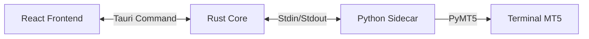

# 🖼️ Interface Gráfica e Sidecars (GUI Overview)

O projeto utiliza **Tauri** para criar aplicativos desktop leves e seguros. A interface é Web (React) mas o "motor" é Rust + Python.

## 🧱 Estrutura dos Componentes

## 🖥️ Frontend (React + Vite)
Localizado em `master_sender/gui` e `client_copier/gui`.
- **`src/services/api.ts`**: Cliente HTTP para falar com o `api_server` (Rust).
- **`src/services/pythonSidecar.ts`**: Gerencia o ciclo de vida do processo Python.
  - Inicia o processo filho.
  - Ouve o `stdout` para logs em tempo real.
  - Mata o processo ao fechar a janela (Kill Switch).

## 🐍 Python Sidecar
É o binário compilado (`sender-service.exe` ou `client-service.exe`) que roda em background.
- É empacotado dentro do app Tauri na pasta `src-tauri/binaries`.
- **NÃO** tem interface própria (console oculto).
- Comunica status imprimindo logs estruturados no stdout, que o Tauri lê e mostra na GUI.

## 🔄 Ciclo de Vida da Aplicação
1. Usuário abre o App (`.exe`).
2. Tauri carrega a janela web (React).
3. React verifica autenticação.
4. Se logado, React invoca o comando Tauri para iniciar o Sidecar.
5. Rust inicia o `.exe` do Python.
6. Python conecta no MT5 e começa a trabalhar.
7. Logs do Python aparecem no console da GUI (`F12` ou área de logs).
