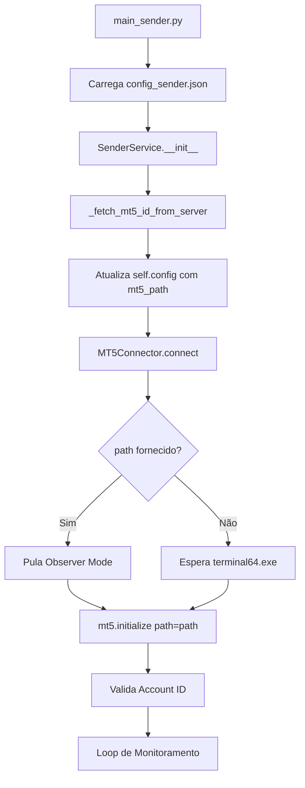

# Guia de Desenvolvimento Python - MT5 Trading System

## 📋 Índice
1. [Visão Geral](#visão-geral)
2. [Dependências Críticas](#dependências-críticas)
3. [Armadilhas Conhecidas](#armadilhas-conhecidas)
4. [Processo de Build](#processo-de-build)
5. [Arquitetura do Código](#arquitetura-do-código)
6. [Debugging e Logs](#debugging-e-logs)

---

## Visão Geral

Este projeto utiliza Python 3.12 para implementar a lógica core de conexão com MetaTrader5 (MT5) e processamento de sinais de trading. Existem dois componentes principais:

- **Master Sender** (`master_sender/`): Monitora conta MT5 master e envia sinais
- **Client Copier** (`client_copier/`): Recebe sinais e replica operações

Ambos são empacotados como executáveis via **PyInstaller** e executados como **Sidecars** pelo Tauri.

---

## Dependências Críticas

### ⚠️ NUMPY - VERSÃO CRÍTICA

> [!CAUTION]
> **NUNCA use Numpy 2.x neste projeto!**

**Problema Identificado:**
- Numpy 2.0+ introduziu mudanças no módulo `numpy._core.multiarray`
- MetaTrader5 (v5.0.5430) depende de estruturas internas do Numpy 1.x
- PyInstaller falha ao empacotar Numpy 2.x corretamente, causando:
  ```
  ModuleNotFoundError: No module named 'numpy'
  ImportError: numpy._core.multiarray failed to import
  ```

**Solução Obrigatória:**
```bash
pip install "numpy<2"
```

**Versão Testada e Estável:**
- `numpy==1.26.4`

### Outras Dependências Principais

```
MetaTrader5==5.0.5430  # API oficial MT5
requests==2.32.5        # Comunicação com API Rust
pyinstaller==6.17.0     # Empacotamento de executáveis
```

---

## Armadilhas Conhecidas

### 1. Race Condition com Múltiplas Instâncias MT5

**Problema:**
Quando Master e Client estão abertos simultaneamente, o `mt5.initialize()` pode conectar na instância errada.

**Causa Raiz:**
O "Observer Mode" (loop que espera `terminal64.exe` aparecer no `tasklist`) não diferencia entre processos. Se o Client já está rodando, o Master pode se conectar nele.

**Solução Implementada:**
```python
# mt5_connector.py (linhas 24-47)
if not path:
    # Só usa Observer Mode se NÃO tiver path específico
    # Loop de tasklist...
else:
    logger.info(f"Target Path provided: {path}. Skipping Observer Mode...")
    # Vai direto para mt5.initialize(path=path)
```

**Lição Aprendida:**
- Sempre forneça `mt5_path` explícito no banco de dados
- Nunca confie em auto-detecção quando há múltiplos terminais

### 2. PyInstaller Hidden Imports

**Problema:**
PyInstaller não detecta automaticamente todas as dependências do MetaTrader5.

**Solução:**
No arquivo `.spec`, sempre inclua:
```python
hiddenimports=['MetaTrader5', 'requests', 'sender_service', 'numpy']
```

### 3. Config Loading em Executáveis

**Problema:**
Caminhos relativos quebram quando o código roda como `.exe`.

**Solução:**
```python
if getattr(sys, 'frozen', False):
    base_dir = os.path.dirname(sys.executable)  # Modo executável
else:
    base_dir = os.path.dirname(os.path.abspath(__file__))  # Modo dev
```

### 4. Single Instance Lock

**Problema:**
Múltiplas instâncias do Master/Client causam duplicação de sinais.

**Solução Implementada:**
```python
# main_sender.py (linhas 30-49)
LOCK_FILE = os.path.join(os.environ.get('TEMP', ''), 'aibot_master.lock')

def check_single_instance():
    if os.path.exists(LOCK_FILE):
        # Mata processo antigo e cria novo lock
```

---

## Processo de Build

### Build Manual (Recomendado)

**Script:** `rebuild_master_clean.ps1` / `rebuild_client_clean.ps1`

**Etapas:**
1. Mata processos em execução
2. Limpa cache do Tauri (`target/` e `dist/`)
3. Recompila Python com PyInstaller:
   ```bash
   pyinstaller sender-service.spec --clean --noconfirm
   ```
4. Copia `.exe` para `gui/src-tauri/`
5. Executa `npm run tauri build`

### ⚠️ Checklist Pré-Build

- [ ] Numpy está em versão `<2.0`
- [ ] Arquivo `.spec` inclui `numpy` nos `hiddenimports`
- [ ] Código Python testado em modo dev (`python main_sender.py --token=...`)
- [ ] Nenhum processo `sender-service.exe` ou `client-service.exe` rodando

### Validação Pós-Build

```bash
# Verificar timestamp do executável
ls -l master_sender/gui/src-tauri/target/release/master-sender.exe

# Testar executável diretamente
./master_sender/gui/src-tauri/target/release/sender-service.exe --token=test123
```

**Logs Esperados:**
```
Starting Secure Master Sender...
Loaded MT5 Path from server: C:\...\terminal64.exe
Target Path provided: ... Skipping Observer Mode...
Connected to MT5 Terminal. Active Account: 7409735
```

---

## Arquitetura do Código

### Fluxo de Inicialização (Master Sender)



### Componentes Principais

#### `main_sender.py`
- **Responsabilidade:** Entry point, parsing de argumentos, single instance lock
- **Argumentos CLI:**
  - `--token` (obrigatório): Token de autenticação
  - `--mt5-id` (opcional): Override do MT5 Login ID

#### `sender_service.py`
- **Responsabilidade:** Lógica de negócio, comunicação com API, detecção de sinais
- **Métodos Críticos:**
  - `_fetch_mt5_id_from_server()`: Busca `mt5_path` e `allowed_mt5_id` do banco
  - `_check_and_send()`: Loop principal de detecção de trades
  - `_send_signal()`: Broadcast de sinais via API com HMAC

#### `mt5_connector.py`
- **Responsabilidade:** Abstração da conexão MT5
- **Método Principal:**
  - `connect(account_config)`: Inicializa MT5 com validação de conta

### Configuração (`config_sender.json`)

```json
{
  "api": {
    "url": "http://127.0.0.1:8000"
  },
  "mt5": {
    "login": 0,  // Sobrescrito pelo servidor
    "path": ""   // Sobrescrito pelo servidor
  },
  "service": {
    "loop_interval": 0.05
  }
}
```

> [!IMPORTANT]
> O `mt5_path` e `allowed_mt5_id` **SEMPRE** vêm do banco de dados via API `/users/me`, nunca do arquivo local.

---

## Debugging e Logs

### Níveis de Log

```python
logging.basicConfig(
    level=logging.INFO,  # Produção
    # level=logging.DEBUG,  # Desenvolvimento
    format='%(asctime)s - %(name)s - %(levelname)s - %(message)s',
    handlers=[
        logging.FileHandler("sender.log"),
        logging.StreamHandler(sys.stdout)
    ]
)
```

### Logs Críticos para Diagnóstico

**Conexão MT5:**
```
✅ Loaded MT5 Path from server: C:\...\terminal64.exe
✅ Target Path provided: ... Skipping Observer Mode...
✅ Connected to MT5 Terminal. Active Account: 7409735
```

**Erros Comuns:**
```
❌ FATAL: Wrong Account! Expected 7409735, Found 11629107
   → Solução: Verificar mt5_path no banco de dados

❌ ModuleNotFoundError: No module named 'numpy'
   → Solução: Rebuild com numpy<2

❌ MT5 Path not loaded from server (empty or None)
   → Solução: Atualizar campo mt5_path na tabela users
```

### Debug de Conexão Isolado

Criar script de teste:
```python
import MetaTrader5 as mt5

path = r"C:\Program Files\...\terminal64.exe"
if mt5.initialize(path=path):
    info = mt5.account_info()
    print(f"Conectado: {info.login}")
else:
    print(f"Erro: {mt5.last_error()}")
```

---

## Melhores Práticas

### ✅ DO

- Use `logging` em vez de `print()`
- Sempre valide `mt5.account_info()` após `initialize()`
- Teste em modo dev antes de buildar
- Mantenha numpy em `<2.0`
- Use `self.config['mt5']['path']` vindo do servidor

### ❌ DON'T

- Nunca confie em auto-detecção de MT5 em produção
- Não use caminhos hardcoded para `terminal64.exe`
- Não ignore warnings do PyInstaller sobre hidden imports
- Não rode múltiplas instâncias sem lock file
- Não use `numpy>=2.0`

---

## Troubleshooting Rápido

| Sintoma | Causa Provável | Solução |
|---------|----------------|---------|
| "Wrong Account" | Race condition | Verificar `mt5_path` no DB |
| "numpy not found" | Build com numpy 2.x | `pip install "numpy<2"` + rebuild |
| Executável não inicia | DLL faltando | Verificar `hiddenimports` no `.spec` |
| Sinais duplicados | Múltiplas instâncias | Verificar lock file em `%TEMP%` |
| API 404 | Servidor Rust offline | Iniciar `cargo run` em `api_server/` |

---

## Referências

- [MetaTrader5 Python Docs](https://www.mql5.com/en/docs/python_metatrader5)
- [PyInstaller Manual](https://pyinstaller.org/en/stable/)
- [Numpy Compatibility](https://numpy.org/devdocs/release/2.0.0-notes.html)
